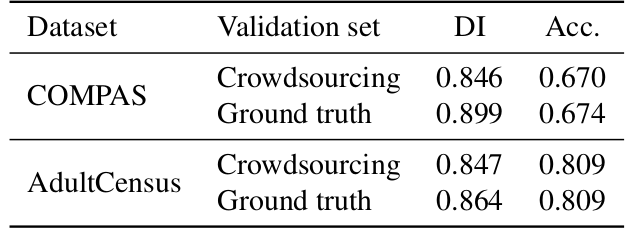

# Exploratory data analysis with COMPAS and AdultCensus datasets.

## COMPAS dataset

- My effort is to preprocess and clean the data similar to the method of IBM's AI Fairness 360 (which is an open source toolkit that can help to examine, report, and mitigate discrimination and bias in machine learning models) including filtering missing data, dropping irrelevant columns, explore new informative features.

- For generation of poisoned data, I poison about 10% of the training data by flipping the labels of examples that belong to a specific z attribute (for this experiment z = 1) so as to maximize the accuracy performance degradation

## Adult Census dataset

2 experiments:
- Using PCA to reduce the dimensions required from 14 to 12.
- Making use of the crowdsourcing data (by following the features selection used by crowdsourcing data) and try to construct a validation set based on that.
    + drop features that are not in crowdsourcing data
    + find similar rows in both crowdsourcing data and original data to separate train data and validation data.

*Table 8 in FR-Train paper Accuracy and fairness of FR-Train when using crowd-sourced labels versus ground truth labels for the validation set.*

## Run experiments on FR-train

- **Run with Ground Truth data from COMPAS dataset.**

    Accuracy : 0.654, Disparate Impact : 0.955 (worse ACC, better DI)

- **Run with poison data from COMPAS dataset.**

    Accuracy : 0.736, Disparate Impact : 0.972 (better ACC, better DI))

- **Run with ground truth data from Adult Cencus dataset (without clean validation set)**

    Accuracy : 0.822, Disparate Impact : 0.925 (better ACC, better DI)

- **Run with real data from Adult Cencus dataset (with crowdsouring validation set)**

    Accuracy : 0.791, Disparate Impact : 0.838 (worse ACC, worse DI)

    *reason: maybe take the mean of all samples is not a great idea. Should have computed worker-specific accuracies by grouping the answers by worker_id and filter out poor performers.*

## Reference
- [fr-train](https://github.com/yuji-roh/fr-train.git)
- [Propublica repo](https://github.com/propublica/compas-analysis)
- [FR-Train: A Mutual Information-Based Approach to Fair and Robust Training (Yuji Roh, Kangwook Lee, Steven Euijong Whang, Changho Suh)](https://arxiv.org/abs/2002.10234)

